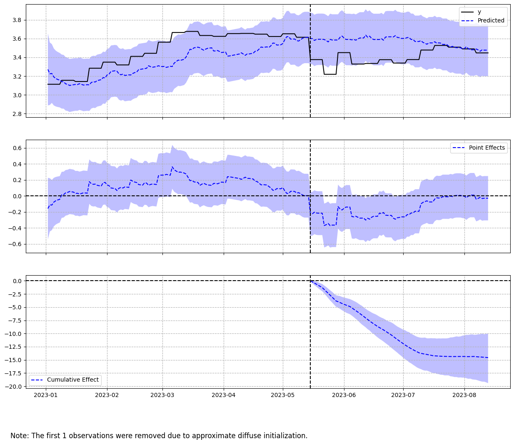

# Inferência causal de transformações recentes no mercado de combustíveis brasileiro

## Objetivo

Estudo de caso de inferência causal com dados públicos, como os da dados da ANP (Agência Nacional do Petróleo, Gás Natural e Biocombustíveis) e das cotações de mercado de _commodities_, a fim de testar e observar os efeitos do fim da subordinação dos valores dos combustíveis à paridade de preços de importação (de petróleo), promulgada pelo 3º mandato do Lula em 16 de maio de 2023. 

Esse evento apresenta uma boa oportunidade de utilizar o citado módulo, o qual faz uso de _Bayesian Structural Time Series Model_ (BSTS), para realizar o controle sintético e inferir se a partir de tal data, o tal do fim da paridade (intervenção/tratamento) surtiu os efeitos esperados e sob qual ordem de magnitude. A oportunidade decorre do fato da variável de controle, que seria o preço da matéria-prima (petróleo), estar desvinculada da intervenção em si, o que permite cumprir a principal premissa do modelo: 

> The model makes as assumption (which is recommended to be confirmed in your data) that the response variable can be precisely modeled by a linear regression with what is known as "covariates" (or X) that __must not be affected by the intervention that took place.__

Escrita em Python, a análise recorreu ao módulo `causalimpact` com o propósito de, não somente saber se houve o impacto esperado no curto prazo, mas se este persistiu ao longo do tempo: por isso, o período pré e pós intervenção são desiguais e amplos (mais de 30 dias de observações). 

Vale destacar que [foi instalado](https://pypi.org/project/pycausalimpact/) o `pycausalimpact` para realizar a aplicação da técnica. Pode instalar o `causalimpact`, mas [ele não possui uma documentação tão boa](https://pypi.org/project/causalimpact/), especialmente para destacar as diferenças metodológicas da técnica entre R e Python - o Google originalmente concebeu isso como uma biblioteca para R, não como um módulo para Python. 

## Conclusão

Houve a aplicação apropriada da técnica, a qual respondeu de forma satisfatória, ao indicar que a partir de 16 de maio houve __uma redução persistente__ de quase 5% do valor da gasolina até meados de agosto de 2023. A imagem abaixo demonstra a aplicação de controle sintético para aferir tal conclusão: 

O relatório dessa avaliação de impacto exibe claramente que 
> _The probability of obtaining this effect by chance is very small (Bayesian one-sided tail-area probability p = 0.0). This means the causal effect can be considered statistically significant._ 

Logo, a intervenção possui significância estatística. 

Ou seja, o que foi anunciado pelo governo (aparentemente) não está somente no campo da retórica. Há um certo conforto em afirmar isso, dado que a variável de controle possui alta correlação com a endógenda (preço da gasolina) e não está vinculada à nova política implementada. 

Pensou-se em realizar esse exercício para diesel, mas a baixa correlação das cotações de petróleo com o preço desse combustível traz cautela para aplicar o BSTS. É preciso encontrar uma variável de controle mais eficiente. 
